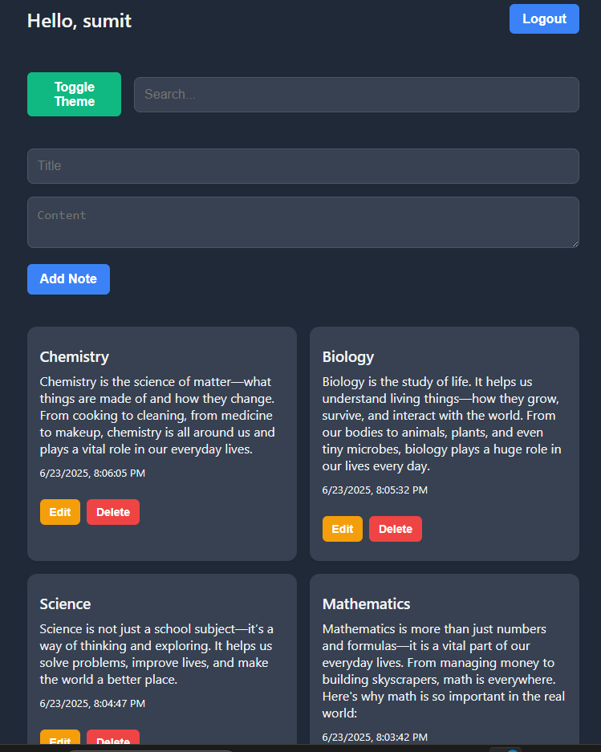

# 📝 Notes App

A full-stack notes-taking application with user authentication and CRUD functionality.

Built with:

- 🔧 **Backend**: Node.js, Express, MongoDB, Mongoose, JWT
- 🌐 **Frontend**: React (Vite), Global CSS, Responsive Design
- 🔐 Auth: JWT-based authentication with secure password hashing
- ☁️ Deployment: Render (backend) + Vercel (frontend)

---

---

🌐 Frontend(Github): "https://github.com/abhishektps4/notes-app"

---

## 🚀 Live Demo
🌐 Live Demo🔗 :  https://notes-app-eight-alpha.vercel.app/signup


---


## 🔑 Features

- ✍️ Create, view, edit, and delete notes
- 🔐 Secure signup/login with JWT and bcrypt
- 👤 User-specific notes
- 🌗 Dark/Light mode toggle (saved in `localStorage`)
- 🔒 Protected routes (dashboard only for authenticated users)
- 🔎 Optional: Search/filter notes
- 📅 Optional: Show note date & time

---

## 🧠 Technologies Used

| Frontend        | Backend           |
|-----------------|-------------------|
| React (Vite)    | Node.js, Express  |
| Global CSS      | MongoDB, Mongoose |
| React Router    | JWT Auth          |
| Context API     | Bcrypt, CORS      |

---

## ⚙️ Environment Setup

### 🔐 Backend `.env`
Create a `.env` file in `/backend`:

```env
PORT=5000
MONGO_URI=your-mongodb-uri
JWT_SECRET=your-secret-key
FRONTEND_URL=https://your-frontend.vercel.app


🔐 Frontend .env
In /frontend/.env:


VITE_API=https://your-backend-api.onrender.com/api

📦 Backend

cd backend
npm install
npm run dev
Visit: http://localhost:5000/api

🌐 Frontend

cd frontend
npm install
npm run dev
Visit: http://localhost:5173


☁️ Deployment Guide
🚀 Backend (Render)
Push /backend to GitHub

Create new Web Service on Render

Set root directory to backend if monorepo

Add env vars (.env)

Build command: npm install

Start command: node server.js

🌍 Frontend (Vercel)
Push /frontend to GitHub

Import project in Vercel

Set root directory: frontend

Add env var:


VITE_API=https://your-backend-api.onrender.com/api

🧑‍💻 Author
Abhishek Raj
💼 GitHub: @abhishek1720044

📄 License
This project is licensed under the MIT License.

